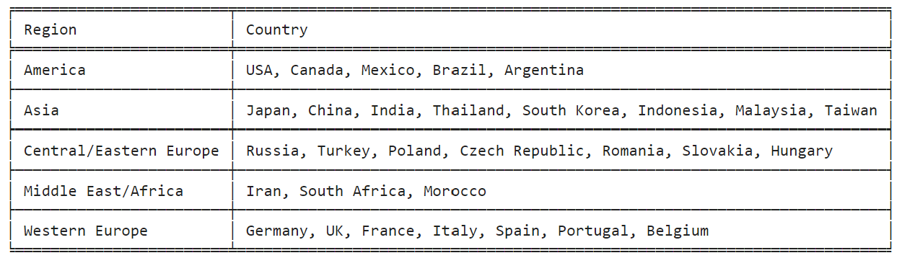
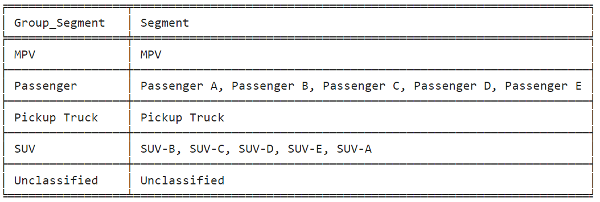
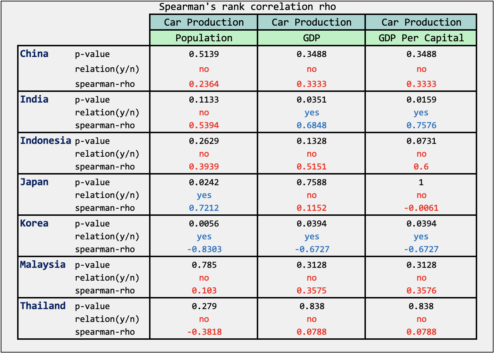

## Mini Project  เรื่อง  การศึกษาปัจจัยที่มีผลกระทบต่อการผลิตรถยนต์สันดาปในภูมิภาคเอเชีย (ASIA)

&nbsp;&nbsp;&nbsp;&nbsp;&nbsp;&nbsp;&nbsp;&nbsp;การศึกษานี้มุ่งเน้นการวิเคราะห์การผลิตรถยนต์สันดาป โดยใช้จำนวนการผลิตรถยนต์เป็นตัวสะท้อนความต้องการของผู้บริโภค การเก็บข้อมูลจากฐานการผลิตรถยนต์สันดาปที่มีเพียงไม่กี่ประเทศ ซึ่งช่วยลดความคลาดเคลื่อนของข้อมูลที่นำมาวิเคราะห์ได้

โดยผลการศึกษา แบ่งเป็น 3 ส่วน ดังนี้

> **Part 1: ภาพรวมการผลิตรถยนต์สันดาปทั่วโลก ตั้งแต่ปี 2014-2023** ขอบเขตการวิเคราะห์ข้อมูลตั้งแต่ปี 2014 – 2023 รวม 10 ปี จำนวน 5 ภูมิภาค ได้แก่  ภูมิภาคเอเชีย ภูมิภาคอเมริกา ภูมิภาคยุโรปตะวันตก ภูมิภาคยุโรปกลางและตะวันออก และภูมิภาคตะวันออกกลาง การนำเสนอข้อมูลแสดงจำนวนการผลิตรถยนต์รายปี จำนวนการผลิตรถยนต์แยกตามภูมิภาค สัดส่วนการผลิตรถยนต์เทียบแต่ละ Segment และ Insights ที่พบจากภาพรวมระดับโลก

> **Part 2: ภาพรวมการผลิตรถยนต์สันดาปในภูมิภาคเอเชีย ตั้งแต่ปี 2014-2023** แสดงสัดส่วนจำนวนการผลิตรายประเทศแบ่งตาม Segment รวมถึง Insights ที่พบสำหรับบาง Segment

> **Part 3: การศึกษาปัจจัยที่มีผลต่อการผลิตรถยนต์ในภูมิภาคเอเชีย (ASIA)** โดยศึกษาปัจจัยทางเศรษฐกิจที่มีผลต่อจำนวนการผลิตรถยนต์

***

### Part 1: ภาพรวมการผลิตรถยนต์สันดาปทั่วโลก ตั้งแต่ปี 2014-2023 
>
&nbsp;&nbsp;&nbsp;&nbsp;&nbsp;&nbsp;&nbsp;&nbsp;ข้อมูลฐานการผลิตรถยนต์ทั่วโลก แบ่งออกเป็น 5 ภูมิภาคหลัก โดยแต่ละภูมิภาคประกอบด้วยประเทศผู้ผลิตที่สำคัญ ตาม**ตารางที่ 1**

  

 ตารางที่ 1 รายชื่อประเทศฐานการผลิตรถยนต์ทั่วโลกที่สำคัญ แบ่งตาม 5 ภูมิภาคหลัก  

  
&nbsp;&nbsp;&nbsp;&nbsp;&nbsp;&nbsp;&nbsp;&nbsp;โดยมีการจำแนกประเภทรถยนต์ตาม Group Segment และ Segment ย่อย เป็น 5 กลุ่ม ได้แก่ MPV (Multi-Purpose Vehicle)  Passenger (รถยนต์นั่งส่วนบุคคล)  Pickup Truck (รถกระบะ) SUV (Sport Utility Vehicle) และ Unclassified ตาม**ตารางที่ 2**

  

 ตารางที่ 2 จำแนกประเภทรถยนต์ตาม Group Segment และ Segment ย่อย  

 รูปที่ 1 รูปประเภทรถยนต์ Passenger, SUV, MPV  และ Pickup Truck ตามลำดับ  

&nbsp;&nbsp;&nbsp;&nbsp;&nbsp;&nbsp;&nbsp;&nbsp;จากข้อมูลภาพรวมการผลิตรถยนต์ทั่วโลกระหว่างปี 2014 ถึง 2023 ตาม**กราฟที่ 1** การผลิตรถยนต์ทั่วโลกอยู่ที่ประมาณ 87.11 ล้านคันต่อปี ในช่วงปี 2014 ถึง 2018 การผลิตรถยนต์มีการเติบโตอย่างต่อเนื่อง โดยมียอดการผลิตสูงสุดในปี 2017 ที่ 95.61 ล้านคัน อย่างไรก็ตาม ปี 2019 เริ่มเห็นสัญญาณของการชะลอตัวเล็กน้อย และในปี 2020 และ 2021 เป็นช่วงเวลาที่ท้าทายอย่างยิ่งสำหรับอุตสาหกรรมยานยนต์ทั่วโลก เนื่องจากการระบาดของ Covid-19 ส่งผลให้ยอดการผลิตลดลง โดยในปี 2020 ยอดการผลิตลดลงเหลือเพียง 75.66 ล้านคัน ซึ่งเป็นจุดต่ำสุดในรอบ 10 ปี สะท้อนให้เห็นถึงผลกระทบอย่างรุนแรงของการระบาดใหญ่ อย่างไรก็ตาม อุตสาหกรรมยานยนต์ สามารถฟื้นตัวกลับมาในปี 2023 ที่มียอดการผลิตถึง 89.21 ล้านคัน ซึ่งใกล้เคียงกับระดับก่อนเกิดการระบาดของ Covid-19
  

 กราฟที่ 1 แสดงจำนวนการผลิตรถยนต์ปี 2014-2023 แบ่งตามภูมิภาค  

&nbsp;&nbsp;&nbsp;&nbsp;&nbsp;&nbsp;&nbsp;&nbsp;เมื่อการวิเคราะห์ข้อมูลการผลิตรถยนต์แยกตามภูมิภาค ตาม**กราฟที่ 2** พบว่า ความโดดเด่นของเอเชียในอุตสาหกรรมยานยนต์โลก โดยภูมิภาคเอเชียมีการผลิตรถยนต์เฉลี่ยสูงถึง 48.22 ล้านคันต่อปี คิดเป็น 55% ของการผลิตทั้งหมดทั่วโลก ขณะที่ภูมิภาคอเมริกา เป็นผู้ผลิตอันดับสอง มีการผลิตเฉลี่ยอยู่ที่ 19.11 ล้านคันต่อปี ความแตกต่างนี้ชี้ให้เห็นว่าเอเชียมีกำลังการผลิตมากกว่าอเมริกาถึงเกือบ 2.5 เท่า
  

 กราฟที่ 2 แสดงค่าเฉลี่ยจำนวนการผลิตรถยนต์แบ่งตามภูมิภาค  

&nbsp;&nbsp;&nbsp;&nbsp;&nbsp;&nbsp;&nbsp;&nbsp;และสำหรับข้อมูลสัดส่วนการผลิตรถยนต์รายปีตามภูมิภาค ตาม**กราฟที่ 3** แสดงให้เห็นถึงการเติบโตอย่างต่อเนื่องของภูมิภาคเอเชียในอุตสาหกรรมยานยนต์โลก โดยสัดส่วนการผลิตของเอเชียเพิ่มขึ้นจาก 53% ในปี 2014 เป็น 60% ในปี 2023 คิดเป็นการเติบโต 7% ในขณะที่ภูมิภาคยุโรปตะวันตกมีแนวโน้มลดลง สาเหตุสำคัญมาจากการที่ประเทศในยุโรปตะวันตก เช่น เยอรมนี ฝรั่งเศส และอังกฤษ ลดการผลิตรถยนต์สันดาปและหันมาเน้นการผลิตรถยนต์ไฟฟ้า (EV) มากขึ้น การเปลี่ยนแปลงนี้สะท้อนถึงการปรับตัวของอุตสาหกรรมยานยนต์ตามแนวโน้มเทคโนโลยีและนโยบายด้านสิ่งแวดล้อม โดยเอเชียยังคงเป็นผู้นำในการผลิตรถยนต์ทั้งแบบสันดาปและรถยนต์ไฟฟ้า
  
.png)

 กราฟที่ 3 แสดงสัดส่วนจำนวนการผลิตรถยนต์แบ่งตามภูมิภาค (รายปี)  

&nbsp;&nbsp;&nbsp;&nbsp;&nbsp;&nbsp;&nbsp;&nbsp;ลำดับถัดมา เมื่อวิเคราะห์สัดส่วนการผลิตรถยนต์ตาม Group Segment ด้วย**กราฟที่ 4** พบว่า รถยนต์นั่งส่วนบุคคล (Passenger) ยังคงเป็นประเภทที่มีการผลิตมากที่สุด โดยมีสัดส่วนสูงถึง 42% ของการผลิตทั้งหมด ตามมาด้วยรถ SUV ที่มีสัดส่วน 33% ซึ่งสะท้อนถึงความนิยมที่เพิ่มขึ้นของรถประเภทนี้ในตลาดโลก รถ MPV และรถกระบะ (Pickup Truck) มีสัดส่วนการผลิตที่น้อยกว่า คือ 5% และ 6% ตามลำดับ ขณะที่รถยนต์ประเภท Unclassified มีสัดส่วน 14% ข้อมูลนี้ชี้ให้เห็นถึงแนวโน้มความต้องการของตลาดที่ยังคงเน้นรถยนต์นั่งส่วนบุคคลและ SUV เป็นหลัก

 กราฟที่ 4 แสดงสัดส่วนจำนวนการผลิตรถยนต์ แบ่งตาม Group Segment  
  

&nbsp;&nbsp;&nbsp;&nbsp;&nbsp;&nbsp;&nbsp;&nbsp;**กราฟที่ 5** แสดงการวิเคราะห์แนวโน้มการผลิตรถยนต์ตาม Group Segment ระหว่างปี 2014-2023 พบว่า การเปลี่ยนแปลงที่สำคัญในอุตสาหกรรมยานยนต์ รถยนต์นั่งส่วนบุคคล (Passenger) มีสัดส่วนลดลงอย่างมีนัยสำคัญจาก 52% ในปี 2014 เหลือ 34% ในปี 2023 ในทางตรงกันข้าม รถ SUV มีความนิยมเพิ่มขึ้นอย่างต่อเนื่อง โดยเฉพาะตั้งแต่ปี 2019 ที่มีสัดส่วนสูงกว่าค่าเฉลี่ย 33% และเพิ่มขึ้นทุกปี จนถึง 43% ในปี 2023 ปัจจัยสำคัญที่ทำให้ SUV ได้รับความนิยมมากขึ้น ได้แก่ ความสามารถในการใช้งานได้ทั้งในเมืองและนอกเมือง ความสะดวกสบาย และความรู้สึกปลอดภัยจากขนาดที่ใหญ่กว่ารถยนต์นั่งส่วนบุคคล แนวโน้มนี้สะท้อนให้เห็นถึงการเปลี่ยนแปลงในความต้องการของผู้บริโภคและการปรับตัวของอุตสาหกรรมยานยนต์
  
.png)

 กราฟที่ 5 แสดงสัดส่วนจำนวนการผลิตรถยนต์แต่ละ Group Segment (รายปี)  

&nbsp;&nbsp;&nbsp;&nbsp;&nbsp;&nbsp;&nbsp;&nbsp;หากวิเคราะห์ลึกลงไปในกลุ่มย่อยของแต่ละ Group Segment จะเห็นว่า สัดส่วนของรถ SUV Segment ที่เป็น SUV-C และ SUV-D ที่เป็นรถยนต์ SUV ขนาดกลางถึงขนาดใหญ่ เป็นที่นิยมมากขึ้น โดยจะเห็นจาก สัดส่วนการผลิตที่เพิ่มขึ้นเป็นเท่าตัวในทั้ง 2 Segment ตาม**กราฟที่ 6**
  
.png)

 กราฟที่ 6 แสดงสัดส่วนจำนวนการผลิตรถยนต์แต่ละ segment (รายปี)
    
  
&nbsp;&nbsp;&nbsp;&nbsp;&nbsp;&nbsp;&nbsp;&nbsp;จากผลการวิเคราะห์ข้อมูลการผลิตรถยนต์ทั่วโลกข้างต้น สรุปได้ว่า ภูมิภาคเอเชีย มีจำนวนการผลิตรถยนต์สันดาปมากที่สุด รองลงมาเป็นภูมิภาคอเมริกา ในด้านประเภท Group Segment รถยนต์นั่งส่วนบุคคล (Passenger car) ยังคงมีสัดส่วนการผลิตสูงสุด รองลงมาคือรถ SUV และแนวโน้มการผลิตกำลังมีการเปลี่ยนแปลง โดยสัดส่วนการผลิตรถยนต์นั่งส่วนบุคคลมีแนวโน้มลดลง ในขณะที่การผลิตรถ SUV กลับเพิ่มขึ้นอย่างต่อเนื่อง
  
***

### Part 2: ภาพรวมการผลิตรถยนต์สันดาปในภูมิภาคเอเชีย ตั้งแต่ปี 2014-2023

&nbsp;&nbsp;&nbsp;&nbsp;&nbsp;&nbsp;&nbsp;&nbsp;ในส่วนที่ 2 ของการศึกษานี้ เราจะมุ่งเน้นไปที่ภาพรวมการผลิตรถยนต์สันดาปในภูมิภาคเอเชียระหว่างปี 2014-2023 จากข้อมูลที่แสดงใน**กราฟที่ 7** เห็นได้ชัดว่าเอเชียมีบทบาทโดดเด่นในการผลิตรถยนต์ระดับโลก โดยครองสัดส่วนการผลิตสูงถึง 55.35% ของการผลิตทั้งหมด คิดเป็นจำนวน 482 ล้านคัน ตลอดช่วงเวลา 10 ปีที่ศึกษา ตามมาด้วยอเมริกาที่ 21.94% และยุโรปตะวันตกที่ 13.88% ตามลำดับ 

 กราฟที่ 7 แสดงสัดส่วนจำนวนการผลิตรถยนต์แบ่งตามภูมิภาค   

&nbsp;&nbsp;&nbsp;&nbsp;&nbsp;&nbsp;&nbsp;&nbsp;ผลจากการวิเคราะห์การผลิตรถยนต์ในภูมิภาคเอเชียระหว่างปี 2014-2023 ตาม**กราฟที่ 8** เผยให้เห็นบทบาทที่โดดเด่นของจีนในฐานะผู้ผลิตรายใหญ่ที่สุด โดยมีส่วนแบ่งการผลิตสูงถึง 55% ของภูมิภาค คิดเป็น 267 ล้านคัน ตามมาด้วยญี่ปุ่นและอินเดียที่มีสัดส่วน 18% และ 10% ตามลำดับ ประเทศไทยอยู่ในอันดับที่ 5 ด้วยสัดส่วน 8% ของการผลิตในภูมิภาค ข้อมูลนี้สะท้อนให้เห็นถึงการกระจุกตัวของการผลิตรถยนต์ในเอเชีย โดยมีจีนเป็นศูนย์กลางหลัก และแสดงให้เห็นถึงความสำคัญของอุตสาหกรรมยานยนต์ในการพัฒนาเศรษฐกิจของประเทศในภูมิภาคนี้

.png)

 กราฟที่ 8 แสดงจำนวนการผลิตรถยนต์ของประเทศภายในภูมิภาค Asia

  

&nbsp;&nbsp;&nbsp;&nbsp;&nbsp;&nbsp;&nbsp;&nbsp;เมื่อพิจารณาสัดส่วนการผลิตรถยนต์ในแต่ละประเทศของภูมิภาคเอเชีย ตาม**กราฟที่ 9** เผยให้เห็นความแตกต่างที่น่าสนใจ จีน อินเดีย และอินโดนีเซียมีสัดส่วนการผลิตรถยนต์ประเภท Unclassified สูงถึงประมาณ 20% ซึ่งอาจสะท้อนถึงการผลิตรถยนต์ที่ตอบสนองความต้องการเฉพาะในท้องถิ่น ประเทศไทยโดดเด่นในการเป็นฐานการผลิตรถกระบะ (Pickup) ที่ใหญ่ที่สุด โดยมีสัดส่วนสูงถึง 52% ของการผลิตทั้งหมดในประเทศ ซึ่งรวมถึงการผลิตเพื่อส่งออก ในขณะที่อินโดนีเซียมีความเชี่ยวชาญในการผลิตรถ MPV โดยมีสัดส่วนสูงถึง 41% ข้อมูลนี้แสดงให้เห็นถึงความหลากหลายและความเชี่ยวชาญเฉพาะด้านในการผลิตรถยนต์ของแต่ละประเทศในภูมิภาคเอเชีย

.png)

 กราฟที่ 9 แสดงสัดส่วนจำนวนการผลิตรถยนต์แบ่งตาม Group Segment (Country)

&nbsp;&nbsp;&nbsp;&nbsp;&nbsp;&nbsp;&nbsp;&nbsp;สำหรับแนวโน้มการผลิตรถยนต์ในภูมิภาคเอเชีย ระหว่างปี 2014-2023  ตาม**กราฟที่ 10** แสดงให้เห็นการเปลี่ยนแปลงที่สำคัญในความนิยมของประเภทรถยนต์ สัดส่วนการผลิตรถยนต์นั่งส่วนบุคคล (Passenger) ลดลงอย่างมีนัยสำคัญจาก 52% ในปี 2014 เหลือ 34% ในปี 2023 ในทางตรงกันข้าม รถ SUV มีความนิยมเพิ่มขึ้นอย่างต่อเนื่อง โดยสัดส่วนเพิ่มจาก 20% เป็น 43% ในช่วงเวลาเดียวกัน โดยเฉพาะตั้งแต่ปี 2019 ที่สัดส่วนของ SUV สูงกว่าค่าเฉลี่ย 34% และเพิ่มขึ้นทุกปี แนวโน้มนี้สอดคล้องกับการวิเคราะห์ภาพรวมการผลิตทั้งหมดก่อนหน้านี้ 

.png)

 กราฟที่ 10 แสดงสัดส่วนจำนวนการผลิตรถยนต์แบ่งตาม Group Segment (รายปี)

     
&nbsp;&nbsp;&nbsp;&nbsp;&nbsp;&nbsp;&nbsp;&nbsp;และสำหรับแนวโน้มการผลิตรถยนต์ในภูมิภาคเอเชียตาม Segment ย่อยระหว่างปี 2014-2023 ตาม**กราฟที่ 11** เผยให้เห็นการเติบโตอย่างโดดเด่นของรถ SUV โดยเฉพาะในกลุ่ม SUV-C และ SUV-D ซึ่งมีสัดส่วนเพิ่มขึ้นอย่างต่อเนื่องทุกปี SUV-C เพิ่มจาก 8% ในปี 2014 เป็น 17% ในปี 2023 ขณะที่ SUV-D เพิ่มจาก 8% เป็น 21% ในช่วงเวลาเดียวกัน แนวโน้มนี้สอดคล้องกับภาพรวมการผลิตรถยนต์ทั่วโลก สะท้อนให้เห็นถึงความนิยมที่เพิ่มขึ้นของรถ SUV ขนาดกลางถึงใหญ่ในตลาดเอเชีย

.png)

 กราฟที่ 11 แสดงสัดส่วนจำนวนการผลิตรถยนต์แบ่งตาม segment (รายปี)

&nbsp;&nbsp;&nbsp;&nbsp;&nbsp;&nbsp;&nbsp;&nbsp;จากผลการวิเคราะห์ข้อมูลการผลิตรถยนต์ในเอเชียระหว่างปี 2014-2023 พบว่า เอเชียมีบทบาทสำคัญในอุตสาหกรรมยานยนต์โลก โดยครองสัดส่วนการผลิตสูงถึง 55% ของการผลิตทั้งหมด โดยจีนเป็นผู้นำในการผลิต ตามด้วยญี่ปุ่นและอินเดีย นอกจากนี้ ยังพบการเปลี่ยนแปลงที่สำคัญในความนิยมของประเภทรถยนต์ โดยสัดส่วนการผลิตรถยนต์นั่งส่วนบุคคลลดลง ขณะที่รถ SUV โดยเฉพาะในกลุ่ม SUV-C และ SUV-D มีความนิยมเพิ่มขึ้นอย่างต่อเนื่อง
เพื่อให้เข้าใจปัจจัยที่ส่งผลต่อการเติบโตและการเปลี่ยนแปลงในอุตสาหกรรมยานยนต์ของภูมิภาคเอเชียอย่างลึกซึ้งยิ่งขึ้น เราจะทำการศึกษาปัจจัยทางเศรษฐกิจ ได้แก่ จำนวนประชากร ผลิตภัณฑ์มวลรวมภายในประเทศ (GDP) และผลิตภัณฑ์มวลรวมภายในประเทศต่อหัว (GDP per capita) ที่มีผลต่อการผลิตรถยนต์ในภูมิภาคเอเชีย ในส่วนที่ 3

***

### Part 3: การศึกษาปัจจัยที่มีผลต่อการผลิตรถยนต์ในภูมิภาคเอเชีย (ASIA)
&nbsp;&nbsp;&nbsp;&nbsp;&nbsp;&nbsp;&nbsp;&nbsp;
ในส่วนนี้จะทำการศึกษาปัจจัยทางเศรษฐกิจแต่ละประเทศที่อาจส่งผลต่อจำนวนการผลิตรถยนต์ในภูมิภาคเอเชีย โดยพิจารณาปัจจัยสำคัญ 3 ประการ ได้แก่
1. จำนวนประชากร (**Population**): วัดเป็นจำนวนคนในแต่ละประเทศ ซึ่งอาจสะท้อนถึงขนาดของตลาดผู้บริโภคและแรงงานที่มีศักยภาพในอุตสาหกรรมยานยนต์
2. ผลิตภัณฑ์มวลรวมภายในประเทศ (**GDP**: Gross Domestic Product (US$)): เป็นตัวชี้วัดมูลค่าตลาดรวมของสินค้าและบริการขั้นสุดท้ายที่ผลิตในประเทศในช่วงเวลาหนึ่ง ซึ่งสะท้อนถึงขนาดและความแข็งแกร่งของเศรษฐกิจโดยรวม
3. ผลิตภัณฑ์มวลรวมภายในประเทศต่อหัว (**GDP per capita** (US$)): คำนวณจาก GDP หารด้วยจำนวนประชากร แสดงถึงระดับรายได้เฉลี่ยและมาตรฐานการครองชีพของประชากรในประเทศนั้นๆ

&nbsp;&nbsp;&nbsp;&nbsp;&nbsp;&nbsp;&nbsp;&nbsp;จาก**ตารางที่ 2** แสดงผลการวิเคราะห์ความสัมพันธ์ระหว่างจำนวนการผลิตรถยนต์กับทั้ง 3  ปัจจัยในแต่ละประเทศของภูมิภาคเอเชีย โดยใช้วิธีการทดสอบ Spearman's rank correlation (ทั้งนี้ เหตุผลในการเลือกใช้วิธีนี้เนื่องจากขนาดของกลุ่มตัวอย่างมีจำนวนน้อย (น้อยกว่า 30) และข้อมูลไม่มีการแจกแจงแบบปกติ)  สำหรับเกณฑ์การพิจารณาความสัมพันธ์ระหว่างตัวแปร คือ หากค่า p-value มากกว่า 0.05 แสดงว่าไม่มีความสัมพันธ์อย่างมีนัยสำคัญทางสถิติระหว่างตัวแปรที่ทดสอบ ผลดังนี้

 การวิเคราะห์ความสัมพันธ์ระหว่างจำนวนการผลิตรถยนต์กับปัจจัยทางเศรษฐกิจ (ประชากร, GDP และ GDP ต่อหัว)

1. **จีน (China)** ไม่พบความสัมพันธ์ที่มีนัยสำคัญระหว่างจำนวนการผลิตรถยนต์กับจำนวนประชากร GDP และ GDP ต่อหัว  
2. **อินเดีย (India)** พบความสัมพันธ์ที่มีนัยสำคัญระหว่างจำนวนการผลิตรถยนต์กับ GDP และ GDP ต่อหัว ที่มีความสัมพันธ์เป็นบวก (spearman-rho > 0) แสดงว่า เมื่อ GDP หรือ GDP ต่อหัวเพิ่มขึ้น ทำให้จำนวนการผลิตรถยนต์มีแนวโน้มเพิ่มขึ้นด้วย  
3. **อินโดนีเซีย (Indonesia)** ไม่พบความสัมพันธ์ที่มีนัยสำคัญระหว่างจำนวนการผลิตรถยนต์กับปัจจัยใดๆ แม้ว่าค่า spearman-rho จะค่อนข้างสูงสำหรับ GDP และ GDP ต่อหัว แต่ p-value ยังสูงเกินกว่าจะสรุปว่า ข้อมูลมีความสัมพันธ์กัน  
4. **ญี่ปุ่น (Japan)** พบความสัมพันธ์ที่มีนัยสำคัญระหว่างจำนวนการผลิตรถยนต์กับประชากร (p-value = 0.0242 < 0.05) ที่มีความสัมพันธ์เป็นบวก (spearman-rho = 0.7212) แสดงว่า เมื่อจำนวนประชากรเพิ่มขึ้น ทำให้จำนวนการผลิตรถยนต์มีแนวโน้มเพิ่มขึ้นด้วย แต่ไม่พบความสัมพันธ์ระหว่างจำนวนการผลิตรถยนต์กับ GDP หรือ GDP ต่อหัว  
5. **เกาหลี (Korea)** พบความสัมพันธ์ที่มีนัยสำคัญระหว่างจำนวนการผลิตรถยนต์กับทุกปัจจัย (p-value < 0.05 ทุกกรณี) และมีความสัมพันธ์เป็นลบ (spearman-rho < 0) แสดงว่าเมื่อปัจจัยเหล่านี้เพิ่มขึ้น ทำให้จำนวนการผลิตรถยนต์มีแนวโน้มลดลง  
6. **มาเลเซีย (Malaysia)** ไม่พบความสัมพันธ์ที่มีนัยสำคัญระหว่างจำนวนการผลิตรถยนต์กับปัจจัยใดๆ เพราะค่า p-value สูงในทุกกรณี  
7. **ไทย (Thailand)** ไม่พบความสัมพันธ์ที่มีนัยสำคัญระหว่างจำนวนการผลิตรถยนต์กับปัจจัยใดๆ เพราะค่า p-value สูงในทุกกรณี   

&nbsp;&nbsp;&nbsp;&nbsp;&nbsp;&nbsp;&nbsp;&nbsp;สรุปภาพรวมการวิเคราะห์ความสัมพันธ์ระหว่างการผลิตรถยนต์และปัจจัยทางเศรษฐกิจในภูมิภาคเอเชีย ดังนี้
1. ความหลากหลายของรูปแบบความสัมพันธ์
- แต่ละประเทศในภูมิภาคเอเชียแสดงรูปแบบความสัมพันธ์ที่แตกต่างกัน สะท้อนถึงความซับซ้อนและความเฉพาะตัวของอุตสาหกรรมยานยนต์ในแต่ละประเทศ
2. ประเทศที่แสดงความสัมพันธ์ชัดเจน
- อินเดียและเกาหลี: พบความสัมพันธ์ที่มีนัยสำคัญระหว่างการผลิตรถยนต์กับ GDP และ GDP ต่อหัว แต่ทิศทางความสัมพันธ์ของทั้งสองประเทศเป็นไปในทางตรงข้ามกัน
- ญี่ปุ่น: เป็นประเทศเดียวที่แสดงความสัมพันธ์อย่างมีนัยสำคัญระหว่างการผลิตรถยนต์กับจำนวนประชากร
3. ประเทศที่ไม่พบความสัมพันธ์ชัดเจนในภาพรวม
- จีน อินโดนีเซีย มาเลเซีย  และไทย ไม่แสดงความสัมพันธ์ที่ชัดเจนระหว่างการผลิตรถยนต์กับปัจจัยที่ศึกษาในระดับประเทศ

&nbsp;&nbsp;&nbsp;&nbsp;&nbsp;&nbsp;&nbsp;&nbsp;สำหรับประเทศที่ไม่พบความสัมพันธ์ในภาพรวม ได้แก่ จีน  อินโดนีเซีย มาเลเซีย และไทย  เป็นต้น จึงได้ทำการวิเคราะห์เพิ่มเติมในระดับ Group Segment ผลลัพธ์ดังนี้

**<u>จีน (China)</u>**

&nbsp;&nbsp;&nbsp;&nbsp;จากแผนภาพ Spearman Correlation Heatmap ของประเทศจีน ผลการวิเคราะห์ความสัมพันธ์ในระดับ Group Segment ดังนี้
1. การผลิตรถยนต์โดยรวม (Car Production (All)) มีความสัมพันธ์เชิงบวกที่ค่อนข้างสูงกับการผลิต SUV (0.73) และรถกระบะ (Pickup) (0.71) และมีความสัมพันธ์เชิงบวกปานกลางกับ GDP และ GDP per capita (0.33)
2. การผลิตรถยนต์นั่งส่วนบุคคล (Car Production (Passenger)) มีความสัมพันธ์เชิงบวกที่สูงมากกับการผลิต MPV (0.82) มีความสัมพันธ์เชิงลบที่สูงมากกับประชากร (-0.88), GDP (-0.81) และ GDP per capita (-0.81)
3. การผลิตรถ SUV (Car Production (SUV)) มีความสัมพันธ์เชิงบวกที่สูงกับ GDP (0.79) และ GDP per capita (0.79) และมีความสัมพันธ์เชิงบวกที่สูงกับประชากร (0.71)
4. การผลิตรถกระบะ (Car Production (Pickup)) มีความสัมพันธ์เชิงลบที่ค่อนข้างสูงกับการผลิตรถที่ไม่ได้จำแนกประเภท (Unclassified) (-0.77)
5. การผลิตรถ MPV (Car Production (MPV)) มีความสัมพันธ์เชิงลบที่สูงมากกับประชากร (-0.88), GDP (-0.88) และ GDP per capita (-0.88)
6. ปัจจัยทางเศรษฐกิจ ได้แก่ ประชากร  GDP และ GDP per capita มีความสัมพันธ์เชิงบวกที่สูงมากระหว่างกัน (0.98-1.00)
>

 รูปที่ 2 แผนภาพ heatmap แสดงความสัมพันธ์กันระหว่างปัจจัยต่างๆ ของประเทศจีน ด้วยสถิติ Spearman  
  
**ข้อสังเกต**
-	การผลิตรถ SUV มีความสัมพันธ์เชิงบวกที่ชัดเจนกับปัจจัยทางเศรษฐกิจทั้งหมด
-	การผลิตรถยนต์นั่งส่วนบุคคลและ MPV มีความสัมพันธ์เชิงลบที่ชัดเจนกับปัจจัยทางเศรษฐกิจ
-	การวิเคราะห์ในระดับ Group Segment นี้ช่วยให้เห็นความสัมพันธ์ที่ซับซ้อนและแตกต่างกันในแต่ละประเภทของการผลิตรถยนต์ในประเทศจีน ซึ่งไม่สามารถเห็นได้จากการวิเคราะห์ในภาพรวมเพียงอย่างเดียว

**<u>อินโดนีเซีย (Indonesia)</u>**

&nbsp;&nbsp;&nbsp;&nbsp;จากแผนภาพ Spearman Correlation Heatmap ของประเทศอินโดนีเซีย ผลการวิเคราะห์ความสัมพันธ์ในระดับ Group Segment ดังนี้
1. การผลิตรถยนต์โดยรวม (Car Production (All)) มีความสัมพันธ์เชิงบวกที่สูงกับการผลิต SUV (0.77) และรถที่ไม่ได้จำแนกประเภท (Unclassified) (0.79) และมีความสัมพันธ์เชิงบวกปานกลางกับ GDP (0.52) และ GDP per capita (0.60)
2. การผลิตรถยนต์นั่งส่วนบุคคล (Car Production (Passenger)) มีความสัมพันธ์เชิงลบที่สูงมากกับประชากร (-0.87), GDP (-0.78) และ GDP per capita (-0.71) แต่ไม่มีความสัมพันธ์ที่ชัดเจนกับการผลิตรถยนต์ประเภทอื่น
3. การผลิตรถ SUV (Car Production (SUV)) มีความสัมพันธ์เชิงบวกที่สูงมากกับ GDP (0.85) และ GDP per capita (0.92) และมีความสัมพันธ์เชิงบวกที่สูงกับประชากร (0.78)
4. การผลิตรถ MPV (Car Production (MPV)) มีความสัมพันธ์เชิงบวกปานกลางกับการผลิตรถยนต์โดยรวม (0.60) แต่ไม่มีความสัมพันธ์ที่ชัดเจนกับปัจจัยทางเศรษฐกิจ
5. การผลิตรถที่ไม่ได้จำแนกประเภท (Car Production (Unclassified)) มีความสัมพันธ์เชิงบวกที่สูงกับการผลิตรถยนต์โดยรวม (0.79) การผลิตรถ SUV (0.78) และมีความสัมพันธ์เชิงบวกปานกลางกับ GDP per capita (0.66)
6. ปัจจัยทางเศรษฐกิจ ได้แก่ ประชากร  GDP และ GDP per capita มีความสัมพันธ์เชิงบวกที่สูงมากระหว่างกัน (0.95-0.99)

 รูปที่ 3 แผนภาพ heatmap แสดงความสัมพันธ์กันระหว่างปัจจัยต่างๆ ของประเทศอินโดนีเซีย ด้วยสถิติ Spearman  
  
**ข้อสังเกต**
-	การผลิตรถ SUV มีความสัมพันธ์เชิงบวกที่ชัดเจนกับปัจจัยทางเศรษฐกิจทั้งหมด เช่นเดียวกับในกรณีของประเทศจีน
-	การผลิตรถยนต์นั่งส่วนบุคคลมีความสัมพันธ์เชิงลบที่ชัดเจนกับปัจจัยทางเศรษฐกิจ ซึ่งคล้ายคลึงกับกรณีของประเทศจีน
-	การผลิตรถ MPV ในอินโดนีเซียไม่แสดงความสัมพันธ์ที่ชัดเจนกับปัจจัยทางเศรษฐกิจ ต่างจากกรณีของประเทศจีน
-	ไม่มีข้อมูลการผลิตรถกระบะในแผนภาพนี้ เพราะไม่มีการผลิต

**<u>มาเลเซีย (Malaysia)</u>**

&nbsp;&nbsp;&nbsp;&nbsp;จากแผนภาพ Spearman Correlation Heatmap ของประเทศมาเลเซีย ผลการวิเคราะห์ความสัมพันธ์ในระดับ Group Segment ดังนี้
1. การผลิตรถยนต์โดยรวม (Car Production (All)) มีความสัมพันธ์เชิงบวกที่สูงมากกับการผลิตรถยนต์นั่งส่วนบุคคล (0.92) และรถที่ไม่ได้จำแนกประเภท (0.90) มีความสัมพันธ์เชิงบวกที่สูงกับการผลิตรถกระบะ (0.75) และ MPV (0.78) และมีความสัมพันธ์เชิงบวกปานกลางกับ GDP และ GDP per capita (0.36)
2. การผลิตรถยนต์นั่งส่วนบุคคล (Car Production (Passenger)) มีความสัมพันธ์เชิงบวกที่สูงกับการผลิตรถกระบะ (0.77), MPV (0.77) และรถที่ไม่ได้จำแนกประเภท (0.85) แต่ไม่มีความสัมพันธ์ที่ชัดเจนกับปัจจัยทางเศรษฐกิจ
3. การผลิตรถ SUV (Car Production (SUV)) มีความสัมพันธ์เชิงบวกที่สูงมากกับประชากร (0.95), GDP (0.87) และ GDP per capita (0.87) และมีความสัมพันธ์เชิงลบเล็กน้อยกับการผลิตรถประเภทอื่น ๆ
4. การผลิตรถกระบะ (Car Production (Pickup)) มีความสัมพันธ์เชิงบวกที่สูงกับการผลิต MPV (0.88) และรถที่ไม่ได้จำแนกประเภท (0.84) แต่ไม่มีความสัมพันธ์ที่ชัดเจนกับปัจจัยทางเศรษฐกิจ
5. การผลิตรถ MPV (Car Production (MPV)) มีความสัมพันธ์เชิงบวกที่สูงกับการผลิตรถกระบะ (0.88) และรถที่ไม่ได้จำแนกประเภท (0.90) แต่ไม่มีความสัมพันธ์ที่ชัดเจนกับปัจจัยทางเศรษฐกิจ
6. การผลิตรถที่ไม่ได้จำแนกประเภท (Car Production (Unclassified)) มีความสัมพันธ์เชิงบวกที่สูงกับการผลิตรถยนต์ประเภทอื่น ๆ ยกเว้น SUV แต่ไม่มีความสัมพันธ์ที่ชัดเจนกับปัจจัยทางเศรษฐกิจ
7. ปัจจัยทางเศรษฐกิจ ได้แก่ ประชากร  GDP และ GDP per capita มีความสัมพันธ์เชิงบวกที่สูงระหว่างกัน (0.79-1.00)

 รูปที่ 4 แผนภาพ heatmap แสดงความสัมพันธ์กันระหว่างปัจจัยต่างๆ ของประเทศมาเลเซีย ด้วยสถิติ Spearman  
  
**ข้อสังเกต**
- การผลิตรถ SUV ในมาเลเซียมีความสัมพันธ์เชิงบวกที่ชัดเจนกับปัจจัยทางเศรษฐกิจทั้งหมด แต่กลับมีความสัมพันธ์เชิงลบเล็กน้อยกับการผลิตรถประเภทอื่น ๆ
- การผลิตรถยนต์ประเภทอื่น ๆ (ยกเว้น SUV) มีความสัมพันธ์เชิงบวกระหว่างกันสูง แต่ไม่มีความสัมพันธ์ที่ชัดเจนกับปัจจัยทางเศรษฐกิจ
- ต่างจากจีนและอินโดนีเซีย การผลิตรถยนต์นั่งส่วนบุคคลในมาเลเซียไม่มีความสัมพันธ์เชิงลบที่ชัดเจนกับปัจจัยทางเศรษฐกิจ

**<u>ไทย (Thailand)</u>**

&nbsp;&nbsp;&nbsp;&nbsp;จากแผนภาพ Spearman Correlation Heatmap ของประเทศไทย ผลการวิเคราะห์ความสัมพันธ์ในระดับ Group Segment ดังนี้
1. การผลิตรถยนต์โดยรวม (Car Production (All)) มีความสัมพันธ์เชิงบวกที่สูงกับการผลิตรถยนต์นั่งส่วนบุคคล (0.73) และมีความสัมพันธ์เชิงบวกปานกลางกับการผลิต SUV (0.56), รถกระบะ (0.56), และ MPV (0.59) แต่ไม่มีความสัมพันธ์ที่ชัดเจนกับปัจจัยทางเศรษฐกิจ
2. การผลิตรถยนต์นั่งส่วนบุคคล (Car Production (Passenger)) มีความสัมพันธ์เชิงบวกที่สูงกับการผลิต MPV (0.79) มีความสัมพันธ์เชิงลบที่สูงกับประชากร (-0.73) และมีความสัมพันธ์เชิงลบปานกลางกับ GDP และ GDP per capita (-0.41)
3. การผลิตรถ SUV (Car Production (SUV)) มีความสัมพันธ์เชิงบวกที่สูงกับ GDP และ GDP per capita (0.70) มีความสัมพันธ์เชิงบวกที่สูงกับการผลิตรถที่ไม่ได้จำแนกประเภท (0.66) และมีความสัมพันธ์เชิงบวกปานกลางกับประชากร (0.49)
4. การผลิตรถกระบะ (Car Production (Pickup)) ไม่มีความสัมพันธ์ที่ชัดเจนกับปัจจัยอื่น ๆ หรือปัจจัยทางเศรษฐกิจ
5. การผลิตรถ MPV (Car Production (MPV)) มีความสัมพันธ์เชิงลบที่สูงมากกับประชากร (-0.88) และมีความสัมพันธ์เชิงบวกที่สูงกับการผลิตรถยนต์นั่งส่วนบุคคล (0.79) แต่มีความสัมพันธ์เชิงลบที่สูงกับ GDP และ GDP per capita (-0.72)
6. การผลิตรถที่ไม่ได้จำแนกประเภท (Car Production (Unclassified)) มีความสัมพันธ์เชิงบวกที่สูงกับประชากร (0.85) GDP (0.71) และ GDP per capita (0.71) แต่มีความสัมพันธ์เชิงลบที่สูงกับการผลิต MPV (-0.62)
7. ปัจจัยทางเศรษฐกิจ ได้แก่ ประชากร  GDP และ GDP per capita มีความสัมพันธ์เชิงบวกที่สูงระหว่างกัน (0.72-1.00)

 รูปที่ 5 แผนภาพ heatmap แสดงความสัมพันธ์กันระหว่างปัจจัยต่างๆ ของประเทศไทย ด้วยสถิติ Spearman  
  
**ข้อสังเกต**
-	การผลิตรถ SUV และรถที่ไม่ได้จำแนกประเภทมีความสัมพันธ์เชิงบวกที่ชัดเจนกับปัจจัยทางเศรษฐกิจ
-	การผลิตรถยนต์นั่งส่วนบุคคลและ MPV มีความสัมพันธ์เชิงลบกับปัจจัยทางเศรษฐกิจ
-	การผลิตรถกระบะ ไม่แสดงความสัมพันธ์ที่ชัดเจนกับปัจจัยใด ๆ ทั้งที่ประเทศไทยเป็นผู้ผลิตรถกระบะรายใหญ่ สาเหตุมาจากประเทศไทย มีการผลิตเพื่อส่งออกรถกระบะเป็นหลัก 60% จากยอดการผลิตทั้งหมด
-	รูปแบบความสัมพันธ์ในไทยมีความแตกต่างจากประเทศอื่น ๆ ที่วิเคราะห์มาก่อนหน้านี้ โดยเฉพาะในส่วนของการผลิตรถกระบะและความสัมพันธ์ระหว่างการผลิตรถยนต์โดยรวมกับปัจจัยทางเศรษฐกิจ

&nbsp;&nbsp;&nbsp;&nbsp;&nbsp;&nbsp;&nbsp;&nbsp;จากการผลวิเคราะห์ความสัมพันธ์ระหว่างการผลิตรถยนต์และปัจจัยทางเศรษฐกิจในภูมิภาคเอเชีย พบว่า แต่ละประเทศมีรูปแบบความสัมพันธ์ที่แตกต่างกัน สะท้อนถึงความซับซ้อนของอุตสาหกรรมยานยนต์ในภูมิภาคนี้ โดยอินเดียและเกาหลีแสดงความสัมพันธ์ที่ชัดเจนระหว่างการผลิตรถยนต์กับ GDP และ GDP ต่อหัว แต่ในทิศทางตรงข้ามกัน ขณะที่ญี่ปุ่นเป็นประเทศเดียวที่แสดงความสัมพันธ์อย่างมีนัยสำคัญระหว่างการผลิตรถยนต์กับจำนวนประชากร **สำหรับจีน อินโดนีเซีย มาเลเซีย และไทย** ไม่พบความสัมพันธ์ชัดเจนในภาพรวม จึงได้วิเคราะห์เพิ่มเติมในระดับ Group Segment พบว่า การผลิตรถ SUV มักมีความสัมพันธ์เชิงบวกกับปัจจัยทางเศรษฐกิจ ขณะที่รถยนต์นั่งส่วนบุคคลและ MPV มักมีความสัมพันธ์เชิงลบ
ขณะเดียวกัน**ประเทศไทย**มีลักษณะเฉพาะที่น่าสนใจ โดยเฉพาะการผลิตรถกระบะที่ไม่แสดงความสัมพันธ์ชัดเจนกับปัจจัยใดๆ สะท้อนถึงความเป็นผู้นำในการผลิตรถกระบะที่อาจไม่ได้ขึ้นอยู่กับปัจจัยทางเศรษฐกิจมากนัก ซึ่งการวิเคราะห์นี้แสดงให้เห็นถึงความหลากหลายและความซับซ้อนของอุตสาหกรรมยานยนต์ในเอเชีย ซึ่งมีปัจจัยเฉพาะในแต่ละประเทศที่ส่งผลต่อรูปแบบการผลิตรถยนต์ที่แตกต่างกัน

***
### ข้อมูลอ้างอิง
>
dataset : https://github.com/maxvcbhan/DADS5001-car-production/blob/main/data/data_1.csv
>
GDP (current US$) : https://data.worldbank.org/indicator/NY.GDP.MKTP.CD
>
GDP per capita (current US$) : https://data.worldbank.org/indicator/NY.GDP.PCAP.CD
>
Population : https://data.worldbank.org/indicator/SP.POP.TOTL
>
coding : 
https://github.com/maxvcbhan/DADS5001-car-production/blob/main/production_car_coding.ipynb
>
chart: 
https://github.com/maxvcbhan/DADS5001-car-production/tree/main/figure
