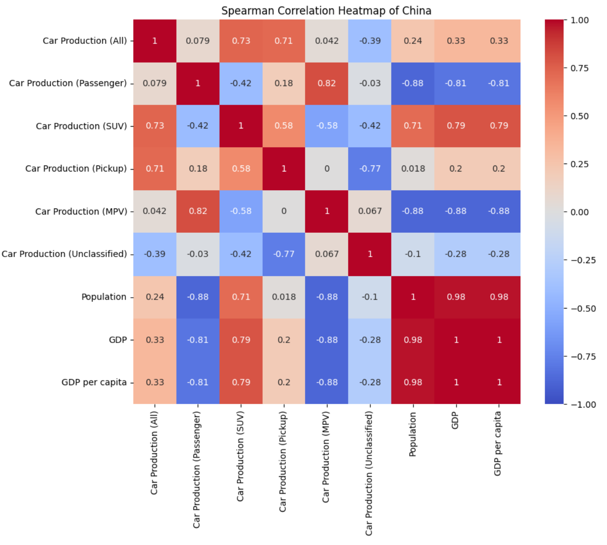
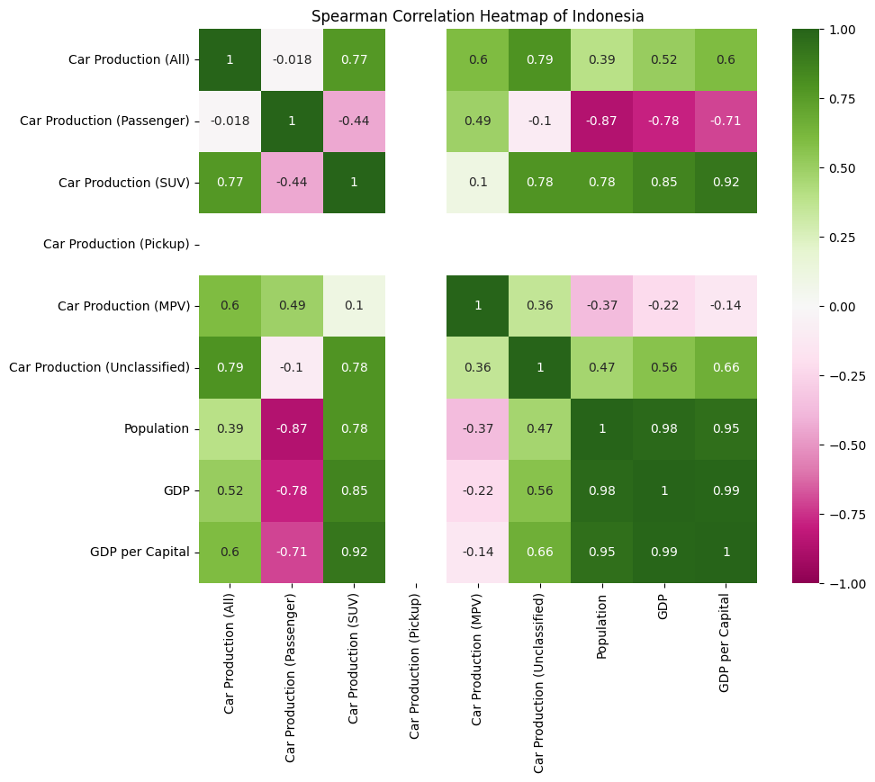
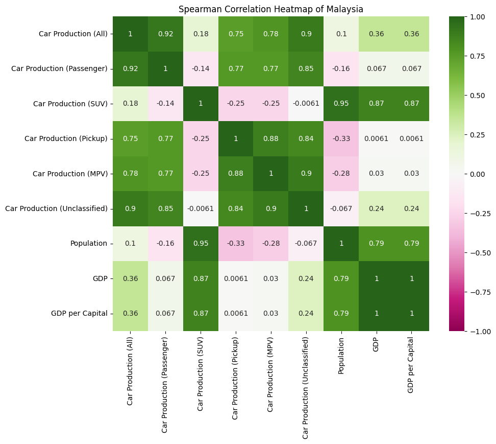
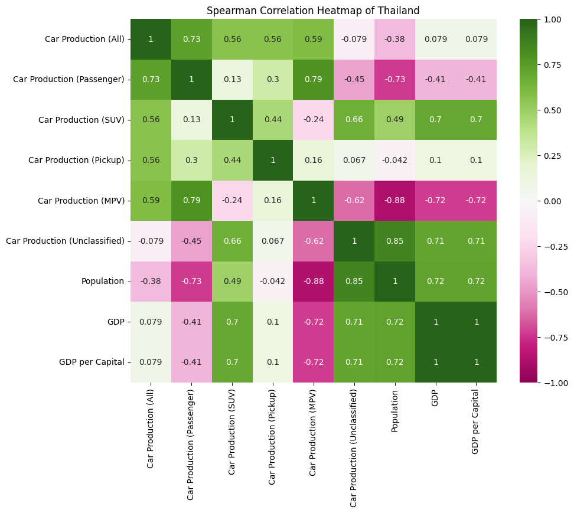

### Mini Project : การศึกษาปัจจัยที่มีผลกระทบต่อการผลิตรถยนต์สันดาปในภูมิภาค Asia

สำหรับ Mini Project นี้ ในการศึกษาการผลิตรถยนต์สันดาป  เนื่องจากจำนวนการผลิตรถยนต์จะสะท้อนความต้องการในการซื้อรถยนต์ของผู้บริโภค และในการจัดเก็บข้อมูลจากฐานการผลิตรถยนต์สันดาป จะมีเพียงไม่กี่ประเทศในโลก ช่วยลดความคลาดเคลื่อนของข้อมูลที่นำมาวิเคราะห์ได้

ในการนำเสนอจะประกอบไปด้วย 3 ส่วน ด้วยกัน ดังนี้

> **Part 1:** ภาพรวมการผลิตรถยนต์สันดาปทั่วโลก ตั้งแต่ปี 2014-2023 โดยประกอบด้วยภูมิภาคดังนี้ 
ภูมิภาคเอเชีย ภูมิภาคอเมริกา ภูมิภาคยุโรปตะวันตก ภูมิภาคยุโรปกลางและตะวันออก ภูมิภาคตะวันออกกลาง 
จะแสดงจำนวนการผลิตรถรายปี จำนวนการผลิตรถแต่ละภูมิภาค สัดส่วนการผลิตรถเทียบแต่ละ segment เป็นต้น รวมถึง insgiht ที่พบสำหรับในมุมภาพรวมของประเทศ

> **Part 2:** ภาพรวมการผลิตรถยนต์สันดาปในภูมิภาคเอเชีย ตั้งแต่ปี 2014-2023
จะเป็นข้อมูลแสดงสัดส่วนจำนวนการผลิตรายประเทศแบ่งตาม segment รวมถึง insgiht ที่พบสำหรับบาง segment

> **Part 3:** การศึกษาปัจจัยที่มีผลกระทบต่อการผลิตรถยนต์ในภูมิภาค Asia โดยศึกษาปัจจัยเพิ่มเติมที่มีผลต่อจำนวนการผลิตรถยนต์

***

### Part 1: ภาพรวมการผลิตรถยนต์สันดาปทั่วโลก

> จากข้อมูลฐานการผลิตรถยนต์ทั่วโลก จะแบ่งเป็น 5 ภูมิภาค โดยในแต่ละภูมิภาคประกอบประเทศต่างๆ ดังนี้

และในส่วนข้อมูลรถยนต์จะจัดเป็น group segment และกลุ่ม segment ย่อย ดังนี้

  

ถัดมาเป็นข้อมูลจำนวนการผลิตรถยนต์ตั้นแต่ปี 2014-2023 ซึ่งจะมีค่าเฉลี่ยในการผลิตรถยนต์รวมทั้งหมดอยู่ที่ 87.11 ล้านคันต่อปี จากกราฟที่ 1 แสดงยอดการผลิตรถยนต์รายปี แบ่งตามภูมิภาคของการผลิต โดยจะเห็นว่าในปี 2020 และ 2021 มียอดการผลิตที่ต่ำลง เนื่องจากเป็นช่วงสถานการณ์ Covid-19 และในปี 2023 จะเห็นว่า มีจำนวนการผลิตกลับมาเพิ่มขึ้นใกล้เคียงกับปี 2019 (ช่วงก่อนสถานการณ์ Covid-19) ซึ่งมียอดการผลิตรถยนต์อยู่ที่ 89.21 ล้านคัน ที่สูงกว่าค่าเฉลี่ยในการผลิตรถยนต์
  
https://github.com/maxvcbhan/DADS5001-car-production/blob/main/figure/figure1_Total%20car%20production%20by%20Year.png

 กราฟที่ 1 แสดงจำนวนการผลิตรถยนต์ปี 2014-2023 แบ่งตามภูมิภาค  

ถัดมาเป็นข้อมูลการผลิตรถยนต์แยกตามภูมิภาค จะเห็นว่า ภูมิภาค Asia มีค่าเฉลี่ยการผลิตรถอยู่ที่ 48.22 ล้านคันต่อปี คิดเป็น 55% ของค่าเฉลี่ยรวมทั้งหมดของทุกภูมิภาค และห่างจากอันดับที่ 2 คือ ภูมิภาค America ที่มีค่าเฉลี่ยการผลิตรถอยู่ที่ 19.11 ล้านคันต่อปี ซึ่งจำนวนการผลิตรถของ Asia มากกว่า เกือบ 2.5 เท่าของจำนวนการผลิตของภูมิภาค America (ข้อมูลตามกราฟที่ 2)
  

 กราฟที่ 2 แสดงค่าเฉลี่ยจำนวนการผลิตรถยนต์แบ่งตามภูมิภาค  

ที่นี้มาดูข้อมูลสัดส่วนการผลิตรถยนต์รายปี แบ่งตามภูมิภาค จะเห็นว่า สัดส่วนการผลิตรถในภูมิภาค Asia มีสัดส่วนที่สูงขึ้นเรื่อยๆ จากปี 2014 ที่มีสัดส่วนอยู่ที่ 53% จนมาถึงปี 2023 ที่มีสัดส่วนอยู่ที่ 60% เพิ่มขึ้นมา 7% ซึ่งมาจากการผลิตของภูมิภาค Western Europe ที่มีจำนวนการผลิตลดลง (ข้อมูลตามกราฟที่ 3)
  

 กราฟที่ 3 แสดงสัดส่วนจำนวนการผลิตรถยนต์แบ่งตามภูมิภาค (รายปี)  

ถัดมาไปดูวิเคราะห์ในมุมของ group segment กันบ้าง จากกราฟที่ 4 แสดงสัดส่วนการผลิตรถยนต์ จะเห็นว่า รถยนต์ Passenger มีสัดส่วนสูงที่สุดที่ 42% และรถ SUV มีสัดส่วนรองลงมาอยู่ที่ 33%

 กราฟที่ 4 แสดงสัดส่วนจำนวนการผลิตรถยนต์ แบ่งตาม group segment  
  

ทีนี้ถ้าวิเคราะห์ดูแนวโน้มของรถยนต์แต่ละ group segment รายปี ตั้งแต่ปี 2014-2023 จะเห็นว่า สัดส่วนของรถ Passenger นั้น มีแนวโน้มที่ลดลงจาก 52% (ปี 2014) เป็น 42% (ปี 2023) และในส่วนของรถยนต์ SUV เป็นที่นิยมมากยิ่งขึ้น โดยจะเห็นว่าตั้งแตปี 2019 สัดส่วนของรถ SUV มีเปอร์เซ็นต์สูงกว่าค่าเฉลี่ยที่ 33% และเพิ่มมากขึ้นในทุกปี ซึ่งมาจากหลายๆปัจจัย เช่น ความต้องการรถยนต์ที่สามารถใช้งานได้ทั้งในเมืองและนอกเมือง ความสะดวกสบายที่มากกว่า ความรู้สึกปลอดภัย เนื่องจาก SUV มีขนาดใหญ่และสูงกว่า passenger เป็นต้น (ข้อมูลตามกราฟที่ 5)
  

 กราฟที่ 5 แสดงสัดส่วนจำนวนการผลิตรถยนต์แต่ละ group segment (รายปี)  

หากวิเคราะห์ลึกลงไปในกลุ่มย่อยของแต่ละ group segment จะเห็นว่า สัดส่วนของรถ SUV Segment ที่เป็น SUV-C และ SUV-D ที่เป็นรถยนต์ SUV ขนาดกลางถึงขนาดใหญ่ เป็นที่นิยมมากขึ้น โดยจะเห็นจาก สัดส่วนการผลิตที่เพิ่มขึ้นเป็นเท่าตัวในทั้ง 2 Segment (ข้อมูลตามกราฟที่ 6)
  

 กราฟที่ 6 แสดงสัดส่วนจำนวนการผลิตรถยนต์แต่ละ segment (รายปี)
    
  
จากข้อมูลทั้งหมดข้างต้น สรุปได้ว่า ภูมิภาค Asia มีจำนวนการผลิตยนต์มากที่สุด รองลงมาเป็นภูมิภาค America ส่วนในมุมของ group segment จะผลิต passenger car มากที่สุด รองลงมาเป็น SUV car 
ในมุมของแนวโน้มการผลิตรถยนต์สัดส่วนของการผลิตรถ Passenger มีแนวโน้มลดลง ในขณะที่สัดส่วนของการผลิตรถ SUV มีแนวโน้มเพิ่มมากขึ้น
  
***

### Part 2: ภาพรวมการผลิตรถยนต์สันดาปในภูมิภาคเอเชีย
> จำนวนการผลิตรถยนต์มากที่สุดอยู่ในภูมิภาค Asia โดยมีสัดส่วนการผลิตอยู่ที่ 55% จากจำนวนการผลิตทุกภูมิภาค ด้วยยอดการผลิตรถยนต์จำนวน 482 ล้านคัน (ข้อมูลตามกราฟที่ 7 วงกลม)

 กราฟที่ 7 แสดงสัดส่วนจำนวนการผลิตรถยนต์แบ่งตามภูมิภาค   

ถัดมาวิเคราะห์ในมุมของประเทศที่อยู่ภายในภูมิภาค Asia กันบ้าง จากกราฟที่ 8 แสดงยอดการผลิตรถยนต์โดยรวมตั้งแต่ปี 2014-2023 จะเห็นว่า ประเทศจีนเป็นประเทศที่มีจำนวนการผลิตรถยนต์เป็นอันดับ 1 มีจำนวนการผลิตอยู่ที่ 267 ล้านคัน คิดเป็นสัดส่วน 55% รองลงมาเป็นประเทศญี่ปุ่น และอินเดีย คิดเป็นสัดส่วน 18% และ 10% ตามลำดับ โดยประเทศไทยมีจำนวนการผลิตเป็นอันดับ 4 คิดเป็นสัดส่วนที่ 8% (ข้อมูลตามกราฟที่ 8)

 กราฟที่ 8 แสดงจำนวนการผลิตรถยนต์ของประเทศภายในภูมิภาค Asia

  

จากข้อมูลสัดส่วนของการผลิตรถยนต์ในแต่ละประเทศจะเห็นว่า ประเทศจีน อินเดีย และอินโดนีเซีย จะมีสัดส่วนของการผลิตรถยนต์ประเภท Unclassified เป็นสัดส่วนที่สูงประมาณ 20% เนื่องจากประเทศเหล่านี้เป็นประเทศที่มีจำนวนประชากรเยอะ ดังนั้นจำนวนยี่ห้อในการผลิตรถยนต์ที่เป็นยี่ห้อท้องถิ่น จึงทำให้สัดส่วนของการผลิตรถประเภท Unclassified มีสัดส่วนที่สูงกว่าประเทศอื่นๆ ส่วนในมุมของประเทศไทย เป็นประเทศที่มีสัดส่วนการผลิตรถ Pickup สูงที่สุด 
เนื่องจากไทยเป็นฐานการผลิตรถ Pickup ทั้งในประเทศและส่งออก ส่วนประเทศอินโดนีเซีย มีสัดส่วนของรถยนต์ประเภท MPV สูงที่สุดถึง 41% (ข้อมูลตามกราฟที่ 9)

 กราฟที่ 9 แสดงสัดส่วนจำนวนการผลิตรถยนต์แบ่งตาม group segment (Country)

หากวิเคราะห์ดูแนวโน้มรายปี ตั้งแต่ปี 2014-2023 จะเห็นว่า สัดส่วนของรถ Passenger นั้น มีแนวโน้มที่ลดลงจาก 52% ในปี 2014 เป็น 34% ในปี 2023 และส่วนของรถยนต์ SUV มีสัดส่วนที่มากยิ่งขึ้นจาก 20% เป็น 43% โดยจะเห็นว่าตั้งแตปี 2019 สัดส่วนของรถ SUV มีเปอร์เซ็นต์สูงกว่า ค่าเฉลี่ยที่ 34% และเพิ่มมากขึ้นในทุกปี ซึ่งเป็นแนวโน้มเดียวกันกับที่เห็นก่อนหน้านี้ ที่วิเคราะห์ภาพรวมการผลิตทั้งหมด (ข้อมูลตามกราฟที่ 10)

 กราฟที่ 10 แสดงสัดส่วนจำนวนการผลิตรถยนต์แบ่งตาม group segment (รายปี)

     
หากดูข้อมูลในแต่ละ Segment ย่อย จะเห็นว่า รถ SUV ใน Segment SUV-C และ SUV-D เป็นที่นิยมในสัดส่วนที่มีแนวโน้มสูงขึ้นต่อเนื่องทุกปี ซึ่งก็จะเห็นเป็นภาพเดียวกันกับแนวโน้มตามภูมิภาคของโลก (ข้อมูลตามกราฟที่ 11)

 กราฟที่ 11 แสดงสัดส่วนจำนวนการผลิตรถยนต์แบ่งตาม segment (รายปี)

***

### Part 3: การศึกษาปัจจัยที่มีผลกระทบต่อการผลิตรถยนต์ในโซน Asia
> ในส่วนนี้จะทำการศึกษาปัจจัยเพิ่มเติมที่อาจส่งผลต่อจำนวนการผลิตรถยนต์ในภูมิภาคเอเชีย โดยพิจารณาปัจจัยสำคัญ 3 ประการ ได้แก่
1. จำนวนประชากร (**Population**): วัดเป็นจำนวนคนในแต่ละประเทศ ซึ่งอาจสะท้อนถึงขนาดของตลาดผู้บริโภคและแรงงานที่มีศักยภาพในอุตสาหกรรมยานยนต์
2. ผลิตภัณฑ์มวลรวมภายในประเทศ (**GDP**: Gross Domestic Product): เป็นตัวชี้วัดมูลค่าตลาดรวมของสินค้าและบริการขั้นสุดท้ายที่ผลิตในประเทศในช่วงเวลาหนึ่ง ซึ่งสะท้อนถึงขนาดและความแข็งแกร่งของเศรษฐกิจโดยรวม
3. ผลิตภัณฑ์มวลรวมภายในประเทศต่อหัว (**GDP Per Capital**): คำนวณจาก GDP หารด้วยจำนวนประชากร แสดงถึงระดับรายได้เฉลี่ยและมาตรฐานการครองชีพของประชากรในประเทศนั้นๆ

จากตารางที่ 1 แสดงผลการวิเคราะห์ความสัมพันธ์ระหว่างจำนวนการผลิตรถยนต์ (y) กับปัจจัยทั้ง 3 ประการในแต่ละประเทศของภูมิภาคเอเชีย โดยใช้วิธีการทดสอบ Spearman's rank correlation (ทั้งนี้ เหตุผลในการเลือกใช้วิธีนี้เนื่องจากขนาดของกลุ่มตัวอย่างมีจำนวนน้อย (น้อยกว่า 30) และข้อมูลไม่มีการแจกแจงแบบปกติ)  สำหรับเกณฑ์การพิจารณาความสัมพันธ์ระหว่างตัวแปร คือ หากค่า p-value มากกว่า 0.05 แสดงว่าไม่มีความสัมพันธ์อย่างมีนัยสำคัญทางสถิติระหว่างตัวแปรที่ทดสอบ ผลดังนี้

 ตารางที่ 1 การวิเคราะห์ความสัมพันธ์ระหว่างจำนวนการผลิตรถยนต์ (y) กับปัจจัยต่างๆ 

1. **จีน (China)** ไม่พบความสัมพันธ์ที่มีนัยสำคัญระหว่างจำนวนการผลิตรถยนต์กับจำนวนประชากร GDP และ GDP ต่อหัว  
2. **อินเดีย (India)** พบความสัมพันธ์ที่มีนัยสำคัญระหว่างจำนวนการผลิตรถยนต์กับ GDP และ GDP ต่อหัว ที่มีความสัมพันธ์เป็นบวก (spearman-rho > 0) แสดงว่า เมื่อ GDP หรือ GDP ต่อหัวเพิ่มขึ้น ทำให้จำนวนการผลิตรถยนต์มีแนวโน้มเพิ่มขึ้นด้วย  
3. **อินโดนีเซีย (Indonesia)** ไม่พบความสัมพันธ์ที่มีนัยสำคัญระหว่างจำนวนการผลิตรถยนต์กับปัจจัยใดๆ แม้ว่าค่า spearman-rho จะค่อนข้างสูงสำหรับ GDP และ GDP ต่อหัว แต่ p-value ยังสูงเกินกว่าจะสรุปว่า ข้อมูลมีความสัมพันธ์กัน  
4. **ญี่ปุ่น (Japan)** พบความสัมพันธ์ที่มีนัยสำคัญระหว่างจำนวนการผลิตรถยนต์กับประชากร (p-value = 0.0242 < 0.05) ที่มีความสัมพันธ์เป็นบวก (spearman-rho = 0.7212) แสดงว่า เมื่อจำนวนประชากรเพิ่มขึ้น ทำให้จำนวนการผลิตรถยนต์มีแนวโน้มเพิ่มขึ้นด้วย แต่ไม่พบความสัมพันธ์ระหว่างจำนวนการผลิตรถยนต์กับ GDP หรือ GDP ต่อหัว  
5. **เกาหลี (Korea)** พบความสัมพันธ์ที่มีนัยสำคัญระหว่างจำนวนการผลิตรถยนต์กับทุกปัจจัย (p-value < 0.05 ทุกกรณี) และมีความสัมพันธ์เป็นลบ (spearman-rho < 0) แสดงว่าเมื่อปัจจัยเหล่านี้เพิ่มขึ้น ทำให้จำนวนการผลิตรถยนต์มีแนวโน้มลดลง  
6. **มาเลเซีย (Malaysia)** ไม่พบความสัมพันธ์ที่มีนัยสำคัญระหว่างจำนวนการผลิตรถยนต์กับปัจจัยใดๆ เพราะค่า p-value สูงในทุกกรณี  
7. **ไทย (Thailand)** ไม่พบความสัมพันธ์ที่มีนัยสำคัญระหว่างจำนวนการผลิตรถยนต์กับปัจจัยใดๆ เพราะค่า p-value สูงในทุกกรณี   

สรุปภาพรวมการวิเคราะห์ความสัมพันธ์ระหว่างการผลิตรถยนต์และปัจจัยทางเศรษฐกิจในภูมิภาคเอเชีย ได้ว่า
1. ความหลากหลายของรูปแบบความสัมพันธ์
- แต่ละประเทศในภูมิภาคเอเชียแสดงรูปแบบความสัมพันธ์ที่แตกต่างกัน สะท้อนถึงความซับซ้อนและความเฉพาะตัวของอุตสาหกรรมยานยนต์ในแต่ละประเทศ
2. ประเทศที่แสดงความสัมพันธ์ชัดเจน
- อินเดียและเกาหลี: พบความสัมพันธ์ที่มีนัยสำคัญระหว่างการผลิตรถยนต์กับ GDP และ GDP ต่อหัว แต่ทิศทางความสัมพันธ์ของทั้งสองประเทศเป็นไปในทางตรงข้ามกัน
- ญี่ปุ่น: เป็นประเทศเดียวที่แสดงความสัมพันธ์อย่างมีนัยสำคัญระหว่างการผลิตรถยนต์กับจำนวนประชากร
3. ประเทศที่ไม่พบความสัมพันธ์ชัดเจนในภาพรวม
- จีน อินโดนีเซีย มาเลเซีย  และไทย ไม่แสดงความสัมพันธ์ที่ชัดเจนระหว่างการผลิตรถยนต์กับปัจจัยที่ศึกษาในระดับประเทศ

สำหรับประเทศที่ไม่พบความสัมพันธ์ในภาพรวม ได้แก่ จีน  อินโดนีเซีย มาเลเซีย และไทย  เป็นต้น จึงได้ทำการวิเคราะห์เพิ่มเติมในระดับ Group Segment ผลลัพธ์ดังนี้

**<u>จีน (China)</u>**

จากแผนภาพ Spearman Correlation Heatmap ของจีน ผลการวิเคราะห์ความสัมพันธ์ในระดับ Group Segment ดังนี้
1. การผลิตรถยนต์โดยรวม (Car Production (All)) มีความสัมพันธ์เชิงบวกที่ค่อนข้างสูงกับการผลิต SUV (0.73) และรถกระบะ (Pickup) (0.71) และมีความสัมพันธ์เชิงบวกปานกลางกับ GDP และ GDP per capita (0.33)
2. การผลิตรถยนต์นั่งส่วนบุคคล (Car Production (Passenger)) มีความสัมพันธ์เชิงบวกที่สูงมากกับการผลิต MPV (0.82) มีความสัมพันธ์เชิงลบที่สูงมากกับประชากร (-0.88), GDP (-0.81) และ GDP per capita (-0.81)
3. การผลิตรถ SUV (Car Production (SUV)) มีความสัมพันธ์เชิงบวกที่สูงกับ GDP (0.79) และ GDP per capita (0.79) และมีความสัมพันธ์เชิงบวกที่สูงกับประชากร (0.71)
4. การผลิตรถกระบะ (Car Production (Pickup)) มีความสัมพันธ์เชิงลบที่ค่อนข้างสูงกับการผลิตรถที่ไม่ได้จำแนกประเภท (Unclassified) (-0.77)
5. การผลิตรถ MPV (Car Production (MPV)) มีความสัมพันธ์เชิงลบที่สูงมากกับประชากร (-0.88), GDP (-0.88) และ GDP per capita (-0.88)
6. ปัจจัยทางเศรษฐกิจ ได้แก่ ประชากร  GDP และ GDP per capita มีความสัมพันธ์เชิงบวกที่สูงมากระหว่างกัน (0.98-1.00)
>

**ข้อสังเกต**
-	การผลิตรถ SUV มีความสัมพันธ์เชิงบวกที่ชัดเจนกับปัจจัยทางเศรษฐกิจทั้งหมด
-	การผลิตรถยนต์นั่งส่วนบุคคลและ MPV มีความสัมพันธ์เชิงลบที่ชัดเจนกับปัจจัยทางเศรษฐกิจ
-	การวิเคราะห์ในระดับ Group Segment นี้ช่วยให้เห็นความสัมพันธ์ที่ซับซ้อนและแตกต่างกันในแต่ละประเภทของการผลิตรถยนต์ในประเทศจีน ซึ่งไม่สามารถเห็นได้จากการวิเคราะห์ในภาพรวมเพียงอย่างเดียว

**<u>อินโดนีเซีย (Indonesia)</u>**

จากแผนภาพ Spearman Correlation Heatmap ของประเทศอินโดนีเซีย ผลการวิเคราะห์ความสัมพันธ์ในระดับ Group Segment ดังนี้
1. การผลิตรถยนต์โดยรวม (Car Production (All)) มีความสัมพันธ์เชิงบวกที่สูงกับการผลิต SUV (0.77) และรถที่ไม่ได้จำแนกประเภท (Unclassified) (0.79) และมีความสัมพันธ์เชิงบวกปานกลางกับ GDP (0.52) และ GDP per capita (0.60)
2. การผลิตรถยนต์นั่งส่วนบุคคล (Car Production (Passenger)) มีความสัมพันธ์เชิงลบที่สูงมากกับประชากร (-0.87), GDP (-0.78) และ GDP per capita (-0.71) แต่ไม่มีความสัมพันธ์ที่ชัดเจนกับการผลิตรถยนต์ประเภทอื่น
3. การผลิตรถ SUV (Car Production (SUV)) มีความสัมพันธ์เชิงบวกที่สูงมากกับ GDP (0.85) และ GDP per capita (0.92) และมีความสัมพันธ์เชิงบวกที่สูงกับประชากร (0.78)
4. การผลิตรถ MPV (Car Production (MPV)) มีความสัมพันธ์เชิงบวกปานกลางกับการผลิตรถยนต์โดยรวม (0.60) แต่ไม่มีความสัมพันธ์ที่ชัดเจนกับปัจจัยทางเศรษฐกิจ
5. การผลิตรถที่ไม่ได้จำแนกประเภท (Car Production (Unclassified)) มีความสัมพันธ์เชิงบวกที่สูงกับการผลิตรถยนต์โดยรวม (0.79) การผลิตรถ SUV (0.78) และมีความสัมพันธ์เชิงบวกปานกลางกับ GDP per capita (0.66)
6. ปัจจัยทางเศรษฐกิจ ได้แก่ ประชากร  GDP และ GDP per capita มีความสัมพันธ์เชิงบวกที่สูงมากระหว่างกัน (0.95-0.99)

**ข้อสังเกต**
-	การผลิตรถ SUV มีความสัมพันธ์เชิงบวกที่ชัดเจนกับปัจจัยทางเศรษฐกิจทั้งหมด เช่นเดียวกับในกรณีของประเทศจีน
-	การผลิตรถยนต์นั่งส่วนบุคคลมีความสัมพันธ์เชิงลบที่ชัดเจนกับปัจจัยทางเศรษฐกิจ ซึ่งคล้ายคลึงกับกรณีของประเทศจีน
-	การผลิตรถ MPV ในอินโดนีเซียไม่แสดงความสัมพันธ์ที่ชัดเจนกับปัจจัยทางเศรษฐกิจ ต่างจากกรณีของประเทศจีน
-	ไม่มีข้อมูลการผลิตรถกระบะในแผนภาพนี้ เพราะไม่มีการผลิต

**<u>มาเลเซีย (Malaysia)</u>**

จากแผนภาพ Spearman Correlation Heatmap ของประเทศมาเลเซีย ผลการวิเคราะห์ความสัมพันธ์ในระดับ Group Segment ดังนี้
1. การผลิตรถยนต์โดยรวม (Car Production (All)) มีความสัมพันธ์เชิงบวกที่สูงมากกับการผลิตรถยนต์นั่งส่วนบุคคล (0.92) และรถที่ไม่ได้จำแนกประเภท (0.90) มีความสัมพันธ์เชิงบวกที่สูงกับการผลิตรถกระบะ (0.75) และ MPV (0.78) และมีความสัมพันธ์เชิงบวกปานกลางกับ GDP และ GDP per capita (0.36)
2. การผลิตรถยนต์นั่งส่วนบุคคล (Car Production (Passenger)) มีความสัมพันธ์เชิงบวกที่สูงกับการผลิตรถกระบะ (0.77), MPV (0.77) และรถที่ไม่ได้จำแนกประเภท (0.85) แต่ไม่มีความสัมพันธ์ที่ชัดเจนกับปัจจัยทางเศรษฐกิจ
3. การผลิตรถ SUV (Car Production (SUV)) มีความสัมพันธ์เชิงบวกที่สูงมากกับประชากร (0.95), GDP (0.87) และ GDP per capita (0.87) และมีความสัมพันธ์เชิงลบเล็กน้อยกับการผลิตรถประเภทอื่น ๆ
4. การผลิตรถกระบะ (Car Production (Pickup)) มีความสัมพันธ์เชิงบวกที่สูงกับการผลิต MPV (0.88) และรถที่ไม่ได้จำแนกประเภท (0.84) แต่ไม่มีความสัมพันธ์ที่ชัดเจนกับปัจจัยทางเศรษฐกิจ
5. การผลิตรถ MPV (Car Production (MPV)) มีความสัมพันธ์เชิงบวกที่สูงกับการผลิตรถกระบะ (0.88) และรถที่ไม่ได้จำแนกประเภท (0.90) แต่ไม่มีความสัมพันธ์ที่ชัดเจนกับปัจจัยทางเศรษฐกิจ
6. การผลิตรถที่ไม่ได้จำแนกประเภท (Car Production (Unclassified)) มีความสัมพันธ์เชิงบวกที่สูงกับการผลิตรถยนต์ประเภทอื่น ๆ ยกเว้น SUV แต่ไม่มีความสัมพันธ์ที่ชัดเจนกับปัจจัยทางเศรษฐกิจ
7. ปัจจัยทางเศรษฐกิจ ได้แก่ ประชากร  GDP และ GDP per capita มีความสัมพันธ์เชิงบวกที่สูงระหว่างกัน (0.79-1.00)

**ข้อสังเกต**
- การผลิตรถ SUV ในมาเลเซียมีความสัมพันธ์เชิงบวกที่ชัดเจนกับปัจจัยทางเศรษฐกิจทั้งหมด แต่กลับมีความสัมพันธ์เชิงลบเล็กน้อยกับการผลิตรถประเภทอื่น ๆ
- การผลิตรถยนต์ประเภทอื่น ๆ (ยกเว้น SUV) มีความสัมพันธ์เชิงบวกระหว่างกันสูง แต่ไม่มีความสัมพันธ์ที่ชัดเจนกับปัจจัยทางเศรษฐกิจ
- ต่างจากจีนและอินโดนีเซีย การผลิตรถยนต์นั่งส่วนบุคคลในมาเลเซียไม่มีความสัมพันธ์เชิงลบที่ชัดเจนกับปัจจัยทางเศรษฐกิจ

**<u>ไทย (Thailand)</u>**

จากแผนภาพ Spearman Correlation Heatmap ของประเทศไทย ผลการวิเคราะห์ความสัมพันธ์ในระดับ Group Segment ดังนี้
1. การผลิตรถยนต์โดยรวม (Car Production (All)) มีความสัมพันธ์เชิงบวกที่สูงกับการผลิตรถยนต์นั่งส่วนบุคคล (0.73) และมีความสัมพันธ์เชิงบวกปานกลางกับการผลิต SUV (0.56), รถกระบะ (0.56), และ MPV (0.59) แต่ไม่มีความสัมพันธ์ที่ชัดเจนกับปัจจัยทางเศรษฐกิจ
2. การผลิตรถยนต์นั่งส่วนบุคคล (Car Production (Passenger)) มีความสัมพันธ์เชิงบวกที่สูงกับการผลิต MPV (0.79) มีความสัมพันธ์เชิงลบที่สูงกับประชากร (-0.73) และมีความสัมพันธ์เชิงลบปานกลางกับ GDP และ GDP per capita (-0.41)
3. การผลิตรถ SUV (Car Production (SUV)) มีความสัมพันธ์เชิงบวกที่สูงกับ GDP และ GDP per capita (0.70) มีความสัมพันธ์เชิงบวกที่สูงกับการผลิตรถที่ไม่ได้จำแนกประเภท (0.66) และมีความสัมพันธ์เชิงบวกปานกลางกับประชากร (0.49)
4. การผลิตรถกระบะ (Car Production (Pickup)) ไม่มีความสัมพันธ์ที่ชัดเจนกับปัจจัยอื่น ๆ หรือปัจจัยทางเศรษฐกิจ
5. การผลิตรถ MPV (Car Production (MPV)) มีความสัมพันธ์เชิงลบที่สูงมากกับประชากร (-0.88) และมีความสัมพันธ์เชิงบวกที่สูงกับการผลิตรถยนต์นั่งส่วนบุคคล (0.79) แต่มีความสัมพันธ์เชิงลบที่สูงกับ GDP และ GDP per capita (-0.72)
6. การผลิตรถที่ไม่ได้จำแนกประเภท (Car Production (Unclassified)) มีความสัมพันธ์เชิงบวกที่สูงกับประชากร (0.85) GDP (0.71) และ GDP per capita (0.71) แต่มีความสัมพันธ์เชิงลบที่สูงกับการผลิต MPV (-0.62)
7. ปัจจัยทางเศรษฐกิจ ได้แก่ ประชากร  GDP และ GDP per capita มีความสัมพันธ์เชิงบวกที่สูงระหว่างกัน (0.72-1.00)

**ข้อสังเกต**
-	การผลิตรถ SUV และรถที่ไม่ได้จำแนกประเภทมีความสัมพันธ์เชิงบวกที่ชัดเจนกับปัจจัยทางเศรษฐกิจ
-	การผลิตรถยนต์นั่งส่วนบุคคลและ MPV มีความสัมพันธ์เชิงลบกับปัจจัยทางเศรษฐกิจ
-	การผลิตรถกระบะไม่แสดงความสัมพันธ์ที่ชัดเจนกับปัจจัยใด ๆ ซึ่งน่าสนใจเนื่องจากไทยเป็นผู้ผลิตรถกระบะรายใหญ่
-	รูปแบบความสัมพันธ์ในไทยมีความแตกต่างจากประเทศอื่น ๆ ที่วิเคราะห์มาก่อนหน้านี้ โดยเฉพาะในส่วนของการผลิตรถกระบะและความสัมพันธ์ระหว่างการผลิตรถยนต์โดยรวมกับปัจจัยทางเศรษฐกิจ

การวิเคราะห์นี้แสดงให้เห็นว่า อุตสาหกรรมยานยนต์ของไทย มีลักษณะเฉพาะที่แตกต่างจากประเทศอื่น ๆ ในภูมิภาค โดยเฉพาะอย่างยิ่งในส่วนของการผลิตรถกระบะที่ไม่แสดงความสัมพันธ์ชัดเจนกับปัจจัยใด ๆ ซึ่งอาจสะท้อนถึงความเป็นผู้นำในการผลิตรถกระบะของไทยที่อาจไม่ได้ขึ้นอยู่กับปัจจัยทางเศรษฐกิจมากนัก
